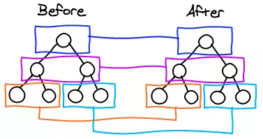
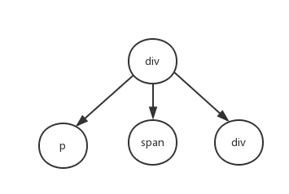

# virtual dom 原理实现

参考资料
[virtual-dom原理与简单实现](https://juejin.im/post/5a21621af265da4304066c8d)

---

## 1. 前端应用状态管理

在日益复杂的前端应用中，状态管理是一个经常被提及的话题，从早期的刀耕火种时代到jQuery，再到现在流行的MVVM时代，状态管理的形式发生了翻天覆地的变化，我们再也不用维护茫茫多的事件回调、监听来更新视图，转而使用使用双向数据绑定，只需要维护相应的数据状态，就可以自动更新视图，极大提高开发效率。

但是，双向数据绑定也并不是唯一的办法，还有一个非常粗暴有效的方式：一旦数据发生变化，重新绘制整个视图，也就是重新设置一下innerHTML。这样的做法确实简单、粗暴、有效，但是如果只是因为局部一个小的数据发生变化而更新整个视图，性价比未免太低了，而且，像事件，获取焦点的输入框等，都需要重新处理。所以，对于小的应用或者说局部的小视图，这样处理完全是可以的，但是面对复杂的大型应用，这样的做法不可取。所以我们可以采取用JavaScript的方法来模拟DOM树，用新渲染的对象树去和旧的树进行对比，记录下变化的变化，然后应用到真实的DOM树上，这样我们只需要更改与原来视图不同的地方，而不需要全部重新渲染一次。这就是virtual-DOM的优势

## 2. 视图渲染

相对于DOM对象，原生的JavaScript对象处理得更快，而且简单。DOM树上的结构，属性信息我们都能通过JavaScript进行表示出来，例如：

```javascript
var element = {
    tagName: 'ul', // 节点标签名
    props: { // dom的属性键值对
        id: 'list'
    },
    children: [
        {tagName: 'li', props: {class: 'item'}, children: ["Item 1"]},
        {tagName: 'li', props: {class: 'item'}, children: ["Item 2"]},
        {tagName: 'li', props: {class: 'item'}, children: ["Item 3"]}
    ]
}
```
那么在html渲染的结果就是：
```javascript
<ul id="list">
    <li class="item">Item 1</li>
    <li class="item">Item 2</li>
    <li class="item">Item 3</li>
</ul>
```

既然能够通过JavaScript表示DOM树的信息，那么就可以通过使用JavaScript来构建DOM树。

然而光是构建DOM树，没什么卵用，我们需要将JavaScript构建的DOM树渲染到真实的DOM树上，用JavaScript表现一个dom一个节点非常简单，我们只需要记录他的节点类型，属性键值对，子节点:

```javascript
function Element(tagName, props, children) {
    this.tagName = tagName
    this.props = props
    this.children = children
}
```
那么ul标签我们就可以使用这种方式来表示

```javascript
var ul = new Element('ul', {id: 'list'}, [
    {tagName: 'li', props: {class: 'item'}, children: ["Item 1"]},
    {tagName: 'li', props: {class: 'item'}, children: ["Item 2"]},
    {tagName: 'li', props: {class: 'item'}, children: ["Item 3"]}
])

```
说了这么多，他只是用JavaScript表示的一个结构，那该如何将他渲染到真实的DOM结构中呢：
```javascript
Element.prototype.render = function() {
    let el = document.createElement(this.tagName), // 节点名称
        props = this.props // 节点属性

    for (var propName in props) {
        propValue = props[propName]
        el.setAttribute(propName, propValue)
    }

    this.children.forEach((child) => {
        var childEl = (child instanceof Element)
            ? child.render()
            : document.createTextNode(child)
        el.appendChild(childEl)
    })
    return el
}
```
如果我们想将ul渲染到DOM结构中，就只需要
```javascript
ulRoot = ul.render()
document.appendChild(ulRoot)
```
这样就完成了ul到DOM的渲染，也就有了真正的DOM结构
```javascript
<ul id="list">
    <li class="item">Item 1</li>
    <li class="item">Item 2</li>
    <li class="item">Item 3</li>
</ul>
```

## 3. 比较虚拟DOM树的差异
React的核心算法是diff算法(这里指的是优化后的算法)我们来看看diff算法是如何实现的：

diff只会对相同颜色方框内的DOM节点进行比较，即同一个父节点下的所有子节点。当发现节点不存在，则该节点和子节点会被完全删除，不会做进一步的比较。

在实际的代码中，会对新旧两棵树进行深度的遍历，给每一个节点进行标记。然后在新旧两棵树的对比中，将不同的地方记录下来。

```javascript
// diff 算法，对比两棵树
function diff(oldTree, newTree) {
    var index = 0   // 当前节点的标志
    var patches = {} // 记录每个节点差异的地方
    dfsWalk(oldTree, newTree, index, patches)
    return patches
}
function dfsWalk(oldNode, newNode, index, patches) {
    // 对比newNode和oldNode的差异地方进行记录
    patches[index] = [...]

    diffChildren(oldNode.children, newNode.children, index, patches)
}
function diffChildren(oldChildren, newChildren, index, patches) {
    let leftNode = null
    var currentNodeIndex = index
    oldChildren.forEach((child, i) => {
        var newChild = newChildren[i]
        currentNodeIndex =  (leftNode && leftNode.count) // 计算节点的标记
                ? currentNodeIndex + leftNode.count + 1
                : currentNodeIndex + 1
        dfsWalk(child, newChild, currentNodeIndex, patches) // 遍历子节点
        leftNode = child
    })
}
```

例如：

在图中如果div有差异，标记为0,那么：
```javascript
patches[0] = [{difference}, {difference}]
```

同理，有p是patches[1], ul是patches[3],以此类推
patches指的是差异变化，这些差异包括：1、节点类型的不同，2、节点类型相同，但是属性值不同，文本内容不同。所以有这么几种类型：
```javascript
var REPLACE = 0,    // replace 替换
    REORDER = 1,    // reorder 父节点中子节点的操作
    PROPS   = 2,    // props 属性的变化
    TEXT    = 3     // text 文本内容的变化
```
如果节点类型不同，就说明是需要替换，例如将div替换成section,就记录下差异：
```javascript
patches[0] = [{
    type: REPLACE,
    node: newNode // section
},{
    type: PROPS,
    props: {
        id: 'container'
    }
}]
```

## 4. 将差异应用到DOM树上

在标题二中构建了真正的DOM树的信息，所以先对那一棵DOM树进行深度优先的遍历，遍历的时候同

patches对象进行对比，找到其中的差异，然后应用到DOM操作中。

```javascript
function patch(node, patches) {
    var walker = {index: 0} // 记录当前节点的标志
    dfsWalk(node, walker, patches)
}

function dfsWalk(node, walker, patches) {
    var currentPatches = patches[walker.index] // 这是当前节点的差异

    var len = node.childNodes
        ? node.childNodes.length
        : 0

    for (var i = 0; i < len; i++) { // 深度遍历子节点
        var child = node.childNodes[i]
        walker.index++
        dfsWalk(child, walker, patches)
    }

    if (currentPatches) {
        applyPatches(node, currentPatches) // 对当前节点进行DOM操作
    }
}
// 将差异的部分应用到DOM中
function applyPatches(node, currentPatches) {
    currentPatches.forEach((currentPatch) => {
        switch (currentPatch.type) {
            case REPLACE:
                var newNode = (typeof currentPatch.node === 'string')
                    ? document.createTextNode(currentPatch.node)
                    : currentPatch.node.render()
                node.parentNode.replaceChild(newNode, node)
                break;
            case REORDER:
                reorderChldren(node, currentPatch.moves)
                break
            case PROPS:
                setProps(node, currentPatch.props)
                break
            case TEXT:
                if (node.textContent) {
                    node.textContent = currentPatch.content
                } else {
                    node.nodeValue = currentPatch.content
                }
                break
            default:
                throw new Error('Unknown patch type ' + currentPatch.type)
        }
    })
}
```