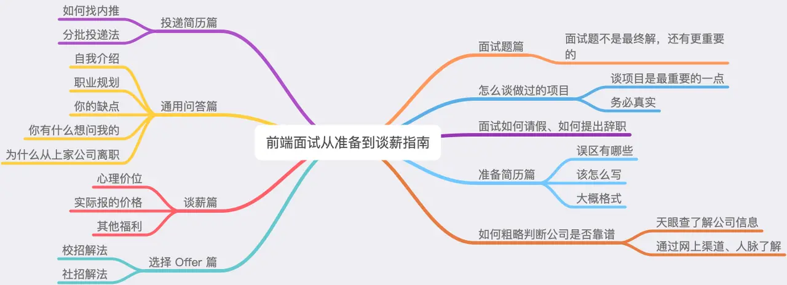

# [前端面试从准备到谈薪指南](https://juejin.im/post/5dfef50751882512444027eb)
---

## 面试题篇
面试题只能应对 1 - 2 面，刷题固然重要，但是对于项目相关的准备也是必须的。一般来说目前面试题能准备的范围如下：
* JS 基础 / 进阶相关
* HTML /  CSS 相关，这方面问的真的很少了
* 浏览器 / 性能优化 / 工程相关
* 框架使用相关，也就是基础问题
* 框架原理相关，就算你没看过源码，你也得知道它的原理，当下的面试基本是不会原理就寸步难行
* 计科相关，比如算法 / 数据结构 / 网络，基本这三样，最多加个操作系统

以上是大致范围，大家可以照着把题目归类，当然除了这些还会有些别的，比如说设计模式等等的问题。另外会刷面试题只是一部分，如果只能生搬硬套，稍微题目变种一下就不会的话也没啥用。更好的办法是把这些内容内化，了解这个题目为什么要这样解，并且和自身的项目所结合。比如说项目中做过性能优化，那么你就可以把相关的性能优化答案都聊一下。

以下几个链接的内容大部分都是笔者身边朋友所写，就职的都是一二线公司。这些内容看完足以，没必要一直盯着面试题去刷，其他还有我们需要准备的内容，面试题并不是本文的重点。

* [中高级前端大厂面试秘籍，为你保驾护航金三银四，直通大厂](https://juejin.im/post/5c64d15d6fb9a049d37f9c20)，内容分为三篇
* [两年工作经验成功面试阿里P6总结](https://juejin.im/post/5d690c726fb9a06b155dd40d)，阿里面试题
* [16年毕业的前端er在杭州求职ing](https://juejin.im/post/5a64541bf265da3e2d338862)，同样也是阿里面试题
* [「中高级前端面试」JavaScript手写代码无敌秘籍](https://juejin.im/post/5c9c3989e51d454e3a3902b6)，现在很多面试题都会涉及到手写某某代码
* [腾讯前端面试篇](https://juejin.im/post/5c19c1b6e51d451d1e06c163)，内容分为两篇，腾讯面试题
* [前端面试考点多？](https://juejin.im/post/5aae076d6fb9a028cc6100a9)，整理了一些常见的面试题
* [三年经验前端面试总结](https://juejin.im/post/5d9c2005f265da5bb977c55e)，内容分为了五篇，面试题涉及公司有头条、百度、饿了么、滴滴
* [一个合格(优秀)的前端都应该阅读这些文章](https://juejin.im/post/5d387f696fb9a07eeb13ea60)，面试题中有不明白的也许可以在这篇文章中找到答案

## 怎么谈做过的项目
### 谈项目是最重要的一点
### 务必真实

谈好项目经历才是面试环节中最重要的一点，即使之前的题目你答得再好，项目经历讲不好依旧凉凉。

项目考察一是为了确认这个项目是否是你做过的，二是为了了解你的技术深度，是否是做过就算还是会有自己的思考。

考察的问题一般分为以下几点：
* 项目基础相关的内容，比如涉及到的技术栈、功能、业务相关的问题。

* 项目具体的细节内容，比如说这个功能你是如何实现的，为什么这样做等等。

* 考察深度问题，比如说你做这个项目的时候有没有遇到过什么问题，是如何解决的，另外也可能会与上面的面试题结合起来问

基于以上几点，你可以这样去准备项目问答：

* 这个项目涉及的技术栈相关的内容，无论是基础的还是深度的，因为这里很可能会问到框架原理。
* 想想做这个项目的过程中是否有遇到过一些困难，最终是如何解决的，实在想不起来的话可以看看 Git Commit。
* 这个项目自己是否做过一些优化，包括代码、开发效率、性能、体验等等相关的领域。
* 这个项目当中存在的一些问题，可能的解决思路。
* 这个项目最终达成的成果。
* 这个项目带给你的成长是什么，当然别说让我学会了某某 API 这种没价值的内容。

## 面试如何请假、辞职

其实真的没必要考虑我该如何请假才能让上级觉得我不是去面试的，当然实话实说请假是去面试的肯定也不行。既然要请假，那么就直接说家里有事、自己有事就行了，一般人不会那么事逼问你到底干嘛去的。

开口提辞职时先要有一个借口，比如什么通勤太远啦、加班太多啦等等的一些个人原因。然后再感激一下领导和公司这一段时间的栽培给自己带来了很大的成长，最后表示在离职之前会认真交接好所有的工作，希望领导能批准自己的离职申请。

这时领导可能会开始挽留你，记住一点：一旦决定辞职就别犹豫，上级挽留也一定不要留下来，因为在你辞职的那一刻起公司就认为你是个不稳定的因子，即使你被挽留下来也不大可能会有什么好的发展，同时也不要因为公司曾经带给了你成长所以犹豫到底要不要走。人往高处走，水往低处流，人生没有不散的宴席。

## 准备简历
### 误区有哪些
### 该怎么写

简历不是用来记你的流水账的。罗列一堆技术点、你完成了什么任务以及你的自我评价没多大价值，只是造就了一份又臭又长的简历。

你可以按照以下几点来修改自己的简历：

* 控制简历页数在 2 页以下，简历不是写得越长越牛逼，而是用内容去吸引人家的。

* 按照用人方的要求以及自身具备但别人不怎么会的领域去写技术栈，不用大篇幅地去罗列技术栈。你熟悉 React 的话人家就默认你熟悉前端三大件了，更不用说用编辑器写代码、用 Git 提交代码、用 Ajax 请求数据了，把原本用来罗列这些技术栈的篇幅留给更重要的项目吧

* 写项目经历的时候把重点的几个项目拿出来介绍就行了，不需要把你做过的所有项目都罗列出来。具体内容可以参考 Star 法则，也就是做了什么，得到了怎样的结果。怎样的结果是最重要的而不是罗列自己做了什么任务。用数据去量化你的结果是一个很好的方式，不知道怎么去量化的话可以多了解下你的上级是如何写 PPT、画大饼的。举个例子你们要提高日活，那么肯定会有个具体提高的数值，这个数值就是可量化的。

* 斟酌熟悉、精通等字眼，不要给自己挖坑。最后确保每一个写上去的技术点自己都能说出点什么，不要出现面试官问你一个技术点却只能答出用过。

* 别用 Word 格式，容易出问题，PDF 是更好的选择。

* 不推荐用模板，要不花里胡哨要不都是招聘网站的 Logo，自己用 Markdown 写完直接转 PDF 就好了。

* 文件命名格式：姓名_求职岗位必写

### 大概格式

一般来说简历的排版格式如下：

排版格式|
---|:--:|---:
你的个人信息：姓名、年级、性别、手机号、邮箱、学校及专业|
你的技术栈，按照用人方来罗列|
项目经历挑几个讲，按照 Star 法则|

## 如何判断公司是否靠谱
### 天眼查了解公司信息
### 通过网上渠道、人脉了解
毕竟不是每个人都能去大公司的，所以分辨一个公司是否靠谱是相当重要的，这关系到将来几个月甚至几年的职业道路。
这里笔者推荐使用「天眼查」去查询一家公司的信息，在这里我们可以查询到一家公司的几个重要指标

* 具体的一个融资情况，一家公司好不好，拥有的资本肯定是重要的一块。一家不错的公司，往往前期融到的金额就很高并且领投的 VC 也是知名的，比如 IDG 资本、高瓴资本、红杉资本等等
* 核心团队的介绍，通过介绍我们可以了解到高管的一个教育背景，行业的经验等等
* 公司涉及到了哪些司法、经营上的风险

然后还可以在脉脉、群里问问这公司是否靠谱，不靠谱的公司就别投递简历了。
## 投递简历篇
### 如何找内推
### 分批投递法

首选一定是内推，实在没办法才选择各大招聘网站投递。现在获取内推的渠道实在太多了，比如微博、知乎、V2ex、脉脉，再不行也还能群里问问。
另外还需要注意分批投递简历，投递前应该先把想投递的几个公司分出几个档次。先投递档次最低的，就算失败了，也就当在攒经验。这样多面几次，把握大了就可以开始投递更加心仪的公司了，增加成功几率。
最后如果你是通过邮件投简历的话，可以选择在早上上班的时候去投递。

## 通用问答题
### 自我介绍

自我介绍应该是 99% 的一面都会问到的一个问题，所以推荐面试前直接写一份自我介绍。
自我介绍是用于让面试官快速了解你信息的一个环节，但是切记不要啰里啰嗦地说一大堆，准备以下几个环节即可：

* 个人信息，就把简历里写的个人信息说一下，另外还可以附带一些个人的荣誉（社招的就不用去讲学校里获得的荣誉了，除非是有什么大赛得过奖）。
* 介绍匹配的技术栈。
* 挑一个个人认为最好的项目说一下，描述方式也是按照 Star 法则。这个项目如果是匹配用人方招聘需求的那就更好了。
* 自身亮点，比如平时有写文章或者维护的 Github 等等，提升面试官对你的好感。

按照上述几个环节，大致可以整理出这样的格式：

> 面试官你好，我叫 XXX，就读于 XX 学校 XX 专业，拥有 XX 年前端工作经验，获得过 ACM 省级金牌（介绍自己获得过有含金量的比赛名次），曾供职于 XX 公司（介绍先前工作过的一二线企业）。我在上家公司任职 XX 岗位，主要负责 XX 工作，擅长 XX 技术栈。其中在我负责的 XX 项目中，我完成了 XX 工作，实现了性能 XX% 的提升（这里就是按照 Star 法则去介绍一个自己负责的最佳项目）。另外我还坚持写作，在 XX 平台发表了 XX 文章，共计获得了 XX 点赞/阅读（这里就是介绍自身的亮点）。以上就是我的自我介绍，谢谢！

### 职业规划

这个其实就是想了解你与公司发展的匹配程度如何。假如说你一个写代码的说过几年想做产品了、运营了、创业了，那么可能就有点危险了。只要你讲出符合自己职业的道路即可，比如说想晋级到高工 -> 架构师等等。

### 缺点

这个问题切记不能回答自己的性格缺陷、能力不行、沟通不好等等，可以说一些工作中遇到的问题。比如说在某次需求评审的时候因为自己没有坚持个人的想法，导致这个需求存在的问题没有解决掉，最后这个项目结果不好没有达到预期等等。

### 你有什么想问我的

这个问题确实不怎么好答，相信很多人都被这个问题困扰过

* 回答没什么想问的呢，可能会给面试官一个你并不想进公司的感觉
* 瞎问呢又怕惹得面试官不高兴了

其实这个问题问得好的话反而是一个能很好了解对方公司的一个渠道。
以下是一些笔者认为不错的提问，能够很好地了解到对方公司的一些东西，包括开发流程、职业晋升、公司发展等等。大家可以选择性地提出 2 - 3 个感兴趣的问题，这样不仅能帮助到自身了解到公司的一些情况，也能给予面试官一个不错的印象，以下问题针对于技术面：

* 公司常用的技术栈是什么？
* 你们如何测试代码？
* 你们如何解决线上故障？
* 你们如何准备故障恢复？是否有完善的发布机制？
* 公司是否有技术分享交流活动？有的话，多久一次呢？
* 一次迭代的流程是怎么样的？从 PRD 评审开始到发布这一整个流程。
* 公司技术团队的架构和人员组成？
* 有公司级别的学习资源吗？比如电子书订阅或者在线课程？
* 你们认为和竞品相比有什么优势？

### 为什么从上家公司离职

这个问题无论如何都不能说上家公司的任何不好，不管是加班多、上下级问题、与同事之间的矛盾或者其他的情况。

一般就把问题归于自身就行，可以说考虑到自身的职业发展，想去一个更加适合自己成长的公司。

## 谈薪篇
### 心理价位
### 实际报价
### 其他福利

到手的才是真的，饼太大容易噎着，当然饼也是有可能兑现的，这就看自身机遇了，一般来说在薪资满意的情况下，再去吃饼：比如说期权。
这里简单说下 offer 里的期权到底是什么。假如公司承诺给你 5000 期权，1 美金的行权价，4 年行权。这就意味着你可以通过 1 美金买一股期权，但是 1 股期权不一定就等比上市后的股票，还可能需要稀释。假如稀释 10 倍的话那也就是 500 股票，你还得花 4 年才能拿到所有的股票，最后行权还有税，所以说大部分的期权其实没啥用。
接下来就是具体谈薪的部分啦。
在面试之前首先要想好自己想要的薪资，假如说你当前薪资为 10K，那么涨幅在 3K 以上是正常的。如果只有 1K - 2K 的涨幅跳槽是没多大意义，毕竟换公司存在成本。另外很多 HR 会压低你的报价，毕竟公司都是有预算的，能省一点是一点，所以我们需要给出一个压价的空间。所以在具体报价的时候你可以给出 14 - 15K 的心理价位，如果对方接受了那么皆大欢喜，如果压价到自己的期望薪资的话也不差。
最后在和 HR 讨论待遇的时候，应该问清楚以下几点

* 具体的工资（也就是合同上签订的工资），不要杂七杂八什么绩效加起来的那种
* 五险一金缴纳的比例，这个在交满和不交满的情况下其实是很大一笔收益。交满虽然自己交的也多了，但是大头公积金是能取出来的，医疗保险看病也用得到，只有养老金稍微虚幻了一点
* 加班是否有加班工资或者调休
* 是否是 996，我个人很不推荐 996 的公司
* 加薪升职的情况
* 其他各种福利，比如餐补、房补、交通补、节假日福利、另外的保险等等，这个算是锦上添花
* 年终奖如何发放，员工平均能拿到几个月

## 选择offer篇
### 校招

对于校招来说，平台 > 团队 > 其他。在平台差不多的情况下可以去选择更好的团队，但是在平台存在差距的情况下务必要选择平台更大的，职业生涯初期就职的平台越好那么将来也会更顺，即使好的平台工资给的低也不要紧，毕竟这段校招的经历不会长。

### 社招

对于社招来说，其实还是看自己缺什么去补什么的。假如说你缺钱，那么可能有更好的平台摆在你面前也会选择给更多钱的一方；假如说你想去个更大的平台，那么可能小平台开的价更高你也不想去；假如说你想通勤近点多陪陪家人，那么远的公司肯定也就不考虑了。
如果你觉得几个条件自己都不缺或者把握不好的，可以参考下笔者的思路：

* 按照权重先这样选择：平台 | 薪资（两者看个人选择） > 团队 > 加班 & 通勤。
* 钱多有时候不一定好。钱多如果加班也多，那肯定比不过薪资差点但是不加班的公司。另外 HR 和你谈的年终奖也不一定拿得到，说不到到了年终把你裁了呢~
* 去深入了解下具体要去的团队，可以加个未来上级的微信聊聊，同时也四处询问下这个团队是否靠谱。毕竟一个团队以及直属领导的好坏，会直接影响着你的绩效和晋升空间。
* 通勤时间，如果你已经有房了，那么通勤时间是需要考虑上的。如果每次通勤需要一小时以上外加公司还要加班的话，其实幸福感会蛮低的。